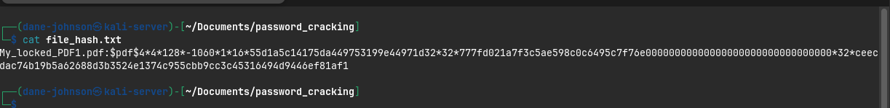
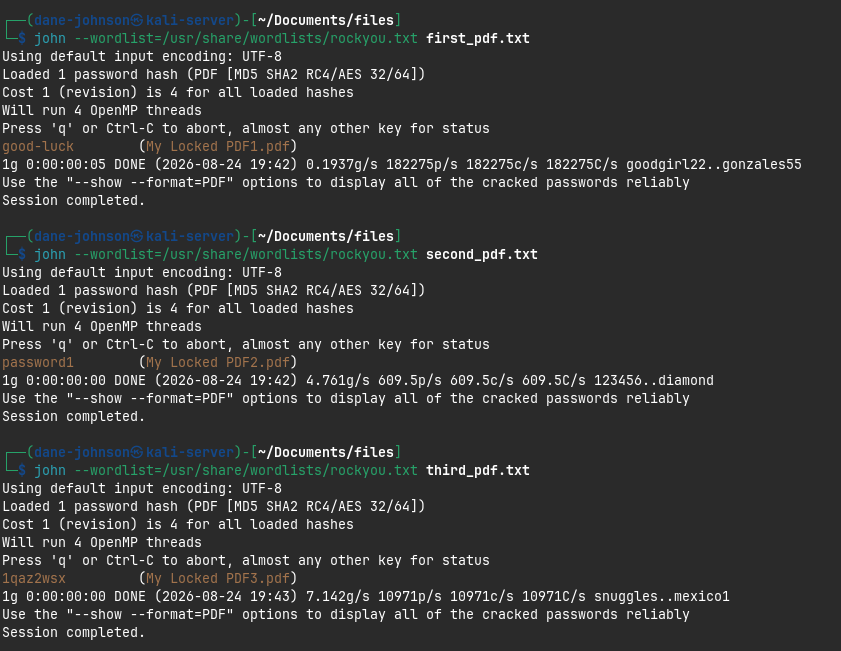
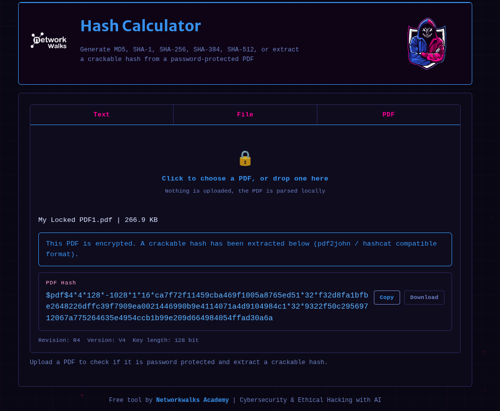

<div align="center">

# Password Cracking 
## John the Ripper & NetworkWalks Tools

</div>

| Pentester Name | Dane Johnson | 
|----------------|--------------|
| Program/Batch  | B082-Network Walks | 
| Date           | August 23, 2026 |
| Modules Completed | W3-PM1<br>W3-PM2 | 
| Client/Target |  Password Protected PDF File | 

### Introduction 

For cybersecurity professionals to effectively protect an organization, they must have a strong understanding of the Tactics, Techniques, and Procedures (TTPs) used by threat actors. This knowledge allows security professionals to simulate real-world attacks by applying similar techniques and tools in a controlled and authorized environment. By doing so, they can identify weaknesses in an organization’s security posture and implement appropriate mitigation measures before those vulnerabilities can be exploited by malicious actors. This report will examine John the Ripper, a widely used password-cracking and auditing tool that can be used to assess the strength of passwords and password-protected resources.


### Tools Used

| Tool | Purpose | 
|------|---------|
| pdf2john | Converts a file to a hash that can be used by John The Ripper |
| John The Ripper | Cross platform password cracking tool | 
| Word List | This is a list of common and known passwords that can be tested against the target file | 
| Network Walks Hash Tool | This is a web-based tool that can be used to generate file hashes |
| Network Walks Password Cracking Tool | This tool uses file hashes and word lists to perform dictinnary attacks | 

### Methodology

For this exercise, three password-protected files will be tested. Although the files and passwords may differ, the overall cracking process remains the same for both toolsets: generate or extract the required password hash, provide an appropriate wordlist, and test the candidate passwords against the hash to identify a match.

#### John the Ripper

1. Use **pdf2john** to extract the password hash from the password-protected PDF file. This hash can then be used by John the Ripper to test potential passwords without directly modifying the original file.

Use the following command: 

```bash
pdf2john My_locked_PDF1.pdf > hash.txt
```
This command generates a text file containing the extracted password hash from the PDF, as shown in the screenshot below.

<div align="center">



</div>

2. The next step is to use **John the Ripper** to attempt to crack the password protecting the PDF file. For this process, the command uses 2  parameters:

- File Hash: The hash file generated earlier using pdf2john.
- Wordlist: A list of possible passwords that John the Ripper will test against the hash. In this example, the RockYou wordlist included with Kali Linux is used.

The following **John the Ripper** command will initiate the password-cracking process by testing passwords from the specified wordlist against the extracted PDF hash.

```bash
john --wordlist=/usr/share/wordlists/rockyou.txt file_hash.txt 
```
If a matching password is found within the specified wordlist, **John the Ripper** will identify and return the password that successfully unlocks the protected PDF file.

Below is the result of the password cracking on each file:

<div align="center">



</div>


### Network Walks Tools

Another password-cracking tool explored during the internship is the Network Walks Tool, which is accessible through a live webpage. It follows a process similar to John the Ripper, where a password hash is first generated and then supplied to the tool along with a wordlist containing potential passwords. The tool tests the entries in the wordlist against the provided hash to identify a match. During testing, this web-based method was observed to be slower than John the Ripper when performing the same general password-cracking task.

See screen shots below:

Hash Created:


Password Cracked:


Once successfully recovered, the password identified by the password-cracking tool can be used to decrypt and access the protected file. The screenshot below demonstrates the three PDF files successfully opened using the recovered password.


### Recommendations

In this demonstration, John the Ripper as well as the tools provided by Network Walks were able to crack the password in varying timeframes, highlighting the risk of using weak or predictable passwords that may already appear in commonly available wordlists. Users should avoid common words and predictable patterns and instead use long, unique passwords. A reputable password manager can also be used to generate and securely store complex, randomized passwords that are significantly more resistant to wordlist-based attacks.

| Author | Dane Johnson BSc. |
|--------|-------------------|
| Batch | Cybersecurity Internship Batch B082| 
| LinkedIn: | https://www.linkedin.com/in/dane-johnson-b9b86916a/ |